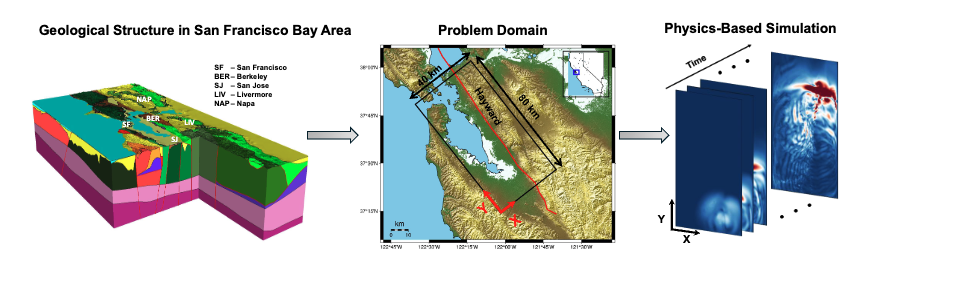
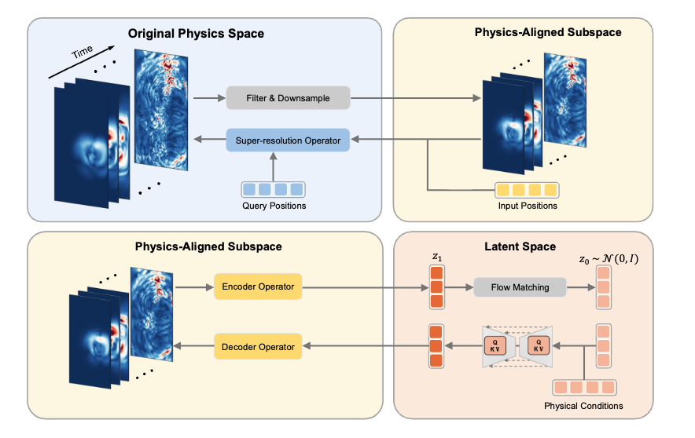
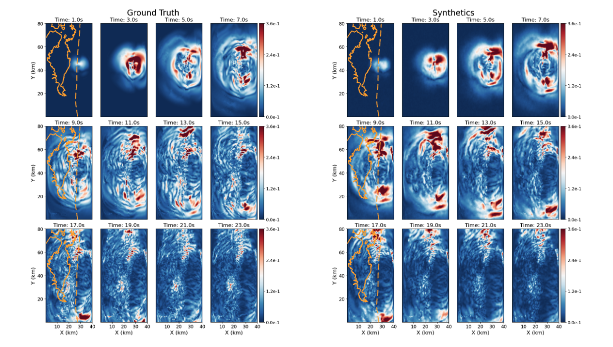

# Large-Scale 3D Ground-Motion Synthesis with Physics-Inspired Latent Operator Flow Matching

## Simulation pipeline


**GMFlow Raw Simulation** is a large-scale open dataset of high-fidelity three-dimensional earthquake ground-motion simulations generated for the GMFlow project. It contains both **point-source** and **finite-rupture** earthquake scenarios for San Francisco Bay Area, covering magnitudes **Mw 4.4**, **Mw 6**, and **Mw 7** . Please download the dataset (.h5 files) from [https://huggingface.co/datasets/Yaozhong/GMFlow_raw_simulation](https://huggingface.co/datasets/Yaozhong/GMFlow_raw_simulation)

The simulations are performed on the supercomputer Perlmutter at the National Energy Research Scientific Computing Center (NERSC), more than 5300 events with a total size of **3.27 TB**, this dataset is intended to support research in earthquake engineering, seismology, scientific machine learning, operator learning, generative modeling, and uncertainty-aware surrogate modeling.

Detailed preprocessing files are provided in ```simulation_process``` folder, please run the `preprocess.py, post_process.py and final_norm.py` sequentially for each magnitude


## Model architecture 


## Results


## Setup and quick start (no need to download the raw simulation dataset)
First download the processed test dataset from [https://huggingface.co/datasets/Yaozhong/GMFlow](https://huggingface.co/datasets/Yaozhong/GMFlow), place the 300 test events under ``dataset`` folder. (100 events for each magnitude).
To set up the environment, create a conda environment

```
# clone project
git clone https://github.com/yzshi5/GMFlow.git
cd gmflow

# create conda environment
conda env create -f environment.yml

# Activate the `gmflow` environment
conda activate gmflow
```
Download the pretrained weights for Super-resolution operator, Autoencoding operator and Flow Matching via the same link, place them under the checkpoints folder. Then to generate a new synthetic event, the event_id ranges (0, 300), where by default 0-100 Mw6, 100-200 Mw7, 200-300 Mw4.4. 

``` 
# standard 
python evaluations/quick_test.py end2end_test event_id

# spectral calibarated with the mean of residual
python evaluations/quick_test_unbias.py end2end_test event_id
```

## Training and Inference
run the training file under ```training_scripts``` to train SNO, AENO and SNO (128M or 16M). For inference, check the paper and folder ```evaluations```, which contains files for residual plot, magnitude scaling, scenario comparison, zero-shot super-resolution, spectral calibaration etc. please first run files with```_calc__``` to save the calculated results, then run the corresponding file with``__plot__`` for visualization.


## Video 

one Mw4.4 scenario


one Mw7 scenario


